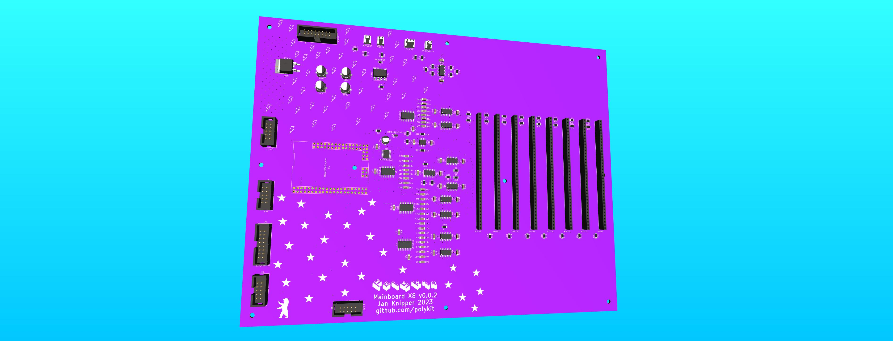

# Polykit X8 Mainboard

_THIS IS NOT A FINISHED PRODUCT IN ANY WAY AND STILL UNDER HEAVY DEVELOPMENT - USE AT YOUR OWN RISK!_

This repository contains Kicad schematics and PCB layout for a main board for a polyphonic synthesizer that is controlled by a micro controller.

Key features:

* 8 voice cards
* 16-bit DAC
* Atmel2560 micro controller
* Eurorack powered
* MIDI input/output

All parameters of the voice cards are controlled by the DAC. That means patches can be stored and recalled.

There is a video playlist on the design process https://makertube.net/w/p/3N2fRjXwT2SfAUv2VkMy3e

Related repositories:

* Voice Card: https://github.com/polykit/polykit-x-voice-card
* Control Board: _soon_
* Software: _soon_
* Power Supply: https://github.com/polykit/eurorack-psu

## BOM

|Reference                                                    |Value           |Footprint                                                     |Qty|
|-------------------------------------------------------------|----------------|--------------------------------------------------------------|---|
|C1, C2, C11-C18, C23-C25, C31-C34, C43-C47, C56-C59, C64, C65|100n ceramic    |Capacitor_SMD:C_1206_3216Metric_Pad1.33x1.80mm_HandSolder     |28 |
|C3-C10, C19-C22, C26-C29, C35-C42, C48-C55                   |10n film, PPS   |Capacitor_SMD:C_1206_3216Metric_Pad1.33x1.80mm_HandSolder     |32 |
|C30                                                          |10u             |Capacitor_SMD:CP_Elec_5x5.9                                   |1  |
|C60-C63                                                      |100u            |Capacitor_SMD:CP_Elec_6.3x7.7                                 |4  |
|D1                                                           |1N4148WS        |Diode_SMD:D_SOD-323_HandSoldering                             |1  |
|J1                                                           |POWER           |Connector_IDC:IDC-Header_2x08_P2.54mm_Vertical                |1  |
|J2                                                           |OUTPUT          |Connector_Molex:Molex_KK-254_AE-6410-03A_1x03_P2.54mm_Vertical|1  |
|J3                                                           |MIDI IN         |Connector_Molex:Molex_KK-254_AE-6410-02A_1x02_P2.54mm_Vertical|1  |
|J4                                                           |MIDI_OUT        |Connector_Molex:Molex_KK-254_AE-6410-02A_1x02_P2.54mm_Vertical|1  |
|J5                                                           |EXTERNAL_IN     |Connector_Molex:Molex_KK-254_AE-6410-02A_1x02_P2.54mm_Vertical|1  |
|J6                                                           |I2C_1           |Connector_IDC:IDC-Header_2x05_P2.54mm_Vertical                |1  |
|J7                                                           |I2C_2           |Connector_IDC:IDC-Header_2x05_P2.54mm_Vertical                |1  |
|J8                                                           |SPI             |Connector_IDC:IDC-Header_2x05_P2.54mm_Vertical                |1  |
|J9                                                           |EXT_ANALOG      |Connector_IDC:IDC-Header_2x08_P2.54mm_Vertical                |1  |
|J10                                                          |EXT_DIGITAL     |Connector_IDC:IDC-Header_2x05_P2.54mm_Vertical                |1  |
|R1-R7, R13-R41                                               |100k            |Resistor_SMD:R_1206_3216Metric_Pad1.30x1.75mm_HandSolder      |36 |
|R8, R42, R43                                                 |1k              |Resistor_SMD:R_1206_3216Metric_Pad1.30x1.75mm_HandSolder      |3  |
|R9-R12, R47                                                  |10k             |Resistor_SMD:R_1206_3216Metric_Pad1.30x1.75mm_HandSolder      |5  |
|R44-R46                                                      |220R            |Resistor_SMD:R_1206_3216Metric_Pad1.30x1.75mm_HandSolder      |3  |
|U1                                                           |Mega2560Pro_Mini|aga:Mega2560Pro_Embed_RobotDyn                                |1  |
|U2, U5, U12, U15                                             |CD4051B         |Package_SO:SO-16_5.3x10.2mm_P1.27mm                           |4  |
|U3, U4, U6-U8, U13, U14, U16, U17, U19                       |TL074           |Package_SO:SO-14_3.9x8.65mm_P1.27mm                           |10 |
|U9                                                           |LM4040AIM3-5.0  |Package_TO_SOT_SMD:SOT-23                                     |1  |
|U10                                                          |AD5676ARUZ      |Package_SO:TSSOP-20_4.4x6.5mm_P0.65mm                         |1  |
|U11                                                          |TL072           |Package_SO:SO-8_3.9x4.9mm_P1.27mm                             |1  |
|U18                                                          |L7905           |Package_TO_SOT_SMD:TO-263-2                                   |1  |
|U20                                                          |6N137           |Package_DIP:DIP-8_W7.62mm_SMDSocket_SmallPads                 |1  |
|VOICE1-VOICE8                                                |VOICE           |Connector_PinSocket_2.54mm:PinSocket_1x36_P2.54mm_Vertical    |8  |

## Tweaks

* If saw/triangle signal is not audible replace R38 with a 220k resistor on the voice cards

## References

https://www.analog.com/media/en/technical-documentation/data-sheets/ad5676.pdf
