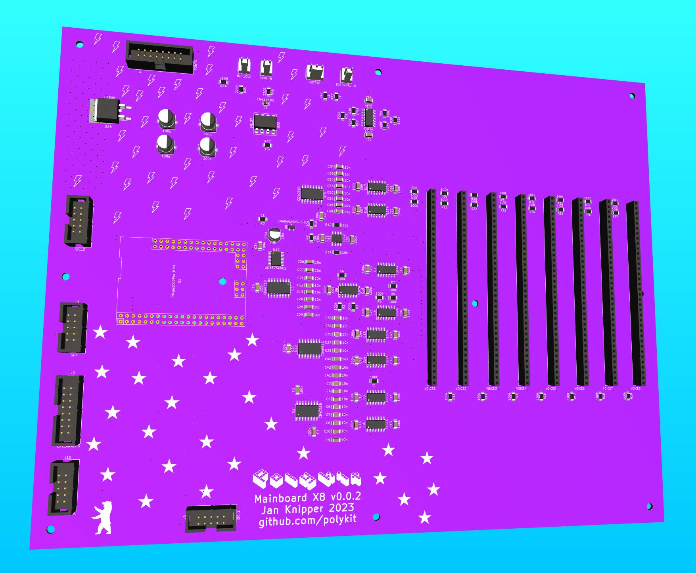

# Polykit X8 Mainboard

_THIS IS NOT A FINISHED PRODUCT IN ANY WAY AND STILL UNDER HEAVY DEVELOPMENT - USE AT YOUR OWN RISK!_

This repository contains Kicad schematics and PCB layout for a main board for a polyphonic synthesizer that is controlled by a micro controller.

Key features:

* 8 voice cards
* 16-bit DAC
* Atmel2560 micro controller
* Eurorack powered
* MIDI input/output

All parameters of the voice cards are controlled by the DAC. That means patches can be stored and recalled.

There is a video playlist on the design process https://makertube.net/w/p/3N2fRjXwT2SfAUv2VkMy3e

Related repositories:

* Voice Card: https://github.com/polykit/polykit-x-voice-card
* Control Board: _soon_
* Software: _soon_
* Power Supply: https://github.com/polykit/eurorack-psu

## BOM

_soon_

## Tweaks

* If saw/triangle signal is not audible replace R38 with a 220k resistor on the voice cards
